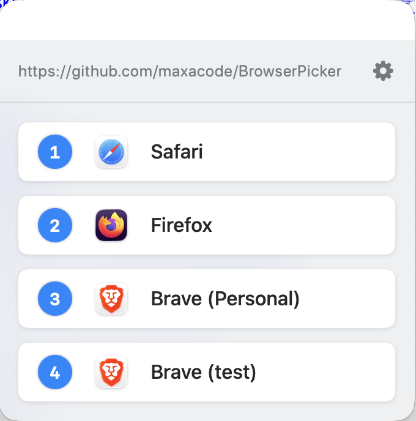
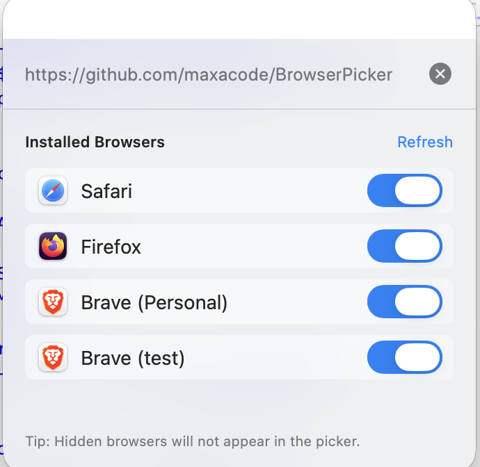

# BrowserPicker 🚀

BrowserPicker is a lightweight, native macOS application that intercepts clicked web links and allows you to choose which browser to open them in by simply typing a number key.





## Features

- **Fast & Lightweight**: Built with Swift and SwiftUI.
- **Keyboard Centric**: Select your browser instantly using number keys (1, 2, 3, etc.).
- **Auto-Detection**: Automatically finds installed browsers like Safari, Chrome, Firefox, Brave, Arc, Edge, and more.
- **Browser Profiles**: Native support for Brave browser profiles, allowing you to route links to specific profiles.
- **Default Browser Toggle**: Easily set BrowserPicker as your system default browser directly from the settings.
- **Customizable List**: Hide browsers you don't use and reorder them to match your preference.
- **Privacy Focused**: No tracking, no data collection. Just a simple routing tool.

## Installation

### Prerequisites

- macOS 11.0 or later.
- Swift installed (default on macOS).

### Build & Install

The easiest way to build and install is to use the provided script:

```bash
./build_local.sh
```

This will compile the app, sign it locally, and move it to your `/Applications` folder.

## Setup

1. **Open the App**: Once installed, open BrowserPicker from your Applications folder.
2. **Set as Default Browser**:
   - Open BrowserPicker.
   - Click the gear icon (⚙️) to open **Settings**.
   - Click **"Set as Default"**. macOS will prompt you to confirm BrowserPicker as your default browser.

## Usage

Whenever you click a link in any app (Mail, Slack, Messages, etc.), BrowserPicker will pop up. Press the number corresponding to your desired browser, and the link will open immediately!

- **Number Keys (1-9)**: Quick-launch a browser.
- **Esc**: Close the picker without opening a link.
- **Drag & Drop**: In settings, reorder browsers to change their numeric shortcuts.

## License

MIT
